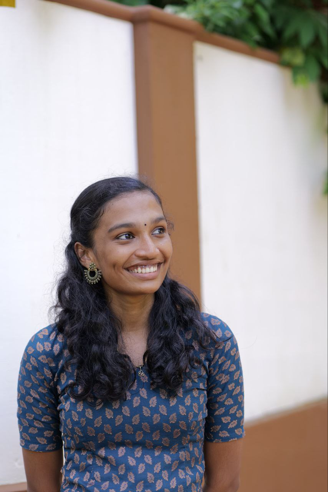

# Portfolio - Athira Radhakrishnan M



## 📌 Overview

This is the personal portfolio website of **Athira Radhakrishnan M**, an aspiring **Data Analyst** and **MSc Computer Science Student**. The portfolio showcases my skills, certifications, projects, and educational background, designed with a focus on professional presentation and responsiveness.

The website is built using **React.js** and **Bootstrap**, featuring a clean, modern UI with smooth navigation and a responsive layout optimized for both desktop and mobile devices.

## 🚀 Features

-   **Responsive Design:** Fully responsive layout ensuring a seamless experience across all devices (Mobile, Tablet, Desktop).
-   **Dynamic Content:** Components for Skills, Certifications, Projects, and Education.
-   **Interactive UI:** Smooth scrolling, sticky header, and hover effects for a polished user experience.
-   **Professional Layout:**
    -   **Home:** Introduction with profile photo and key highlights.
    -   **About:** detailed bio with justified text.
    -   **Skills:** Categorized display of technical and soft skills.
    -   **Certifications:** List of professional certifications.
    -   **Projects:** Showcase of academic and hackathon projects with descriptions.
    -   **Education:** Academic timeline with split layout.
    -   **Contact:** Centralized contact information with links to LinkedIn and GitHub.

## 🛠️ Tech Stack

-   **Frontend:** [React.js](https://reactjs.org/)
-   **Styling:** [Bootstrap 5](https://getbootstrap.com/), Custom CSS
-   **Icons:** Emoji & Bootstrap Icons (if applicable)
-   **Fonts:** Roboto (Google Fonts)

## 📂 Project Structure

```
portfolio.me/
├── public/              # Static assets (images, favicon, etc.)
├── src/
│   ├── components/      # (Optional) Reusable components
│   ├── About.js         # About Me section
│   ├── App.js           # Main application component
│   ├── App.css          # Global styles
│   ├── Certifications.js# Certifications section
│   ├── Contact.js       # Contact section
│   ├── Education.js     # Education section
│   ├── Header.js        # Navigation bar
│   ├── Home.js          # Hero section
│   ├── Projects.js      # Projects showcase
│   ├── Skills.js        # Skills listing
│   └── index.js         # Entry point
├── package.json         # Project dependencies and scripts
└── README.md            # Project documentation
```

## ⚙️ Installation & Setup

To run this project locally, follow these steps:

1.  **Clone the repository:**
    ```bash
    git clone https://github.com/15athira/portfolio.me.git
    cd portfolio.me
    ```

2.  **Install dependencies:**
    ```bash
    npm install
    ```

3.  **Start the development server:**
    ```bash
    npm start
    ```
    The app will open in your browser at `http://localhost:3000`.

## 📬 Contact

Feel free to reach out to me for collaborations or opportunities!

-   **Email:** [athirarkrishnan15@gmail.com](mailto:athirarkrishnan15@gmail.com)
-   **LinkedIn:** [linkedin.com/in/athira-rm](https://linkedin.com/in/athira-rm)
-   **GitHub:** [github.com/15athira](https://github.com/15athira)
-   **Location:** Malappuram, Kerala

---

Made with ❤️ by Athira Radhakrishnan M
